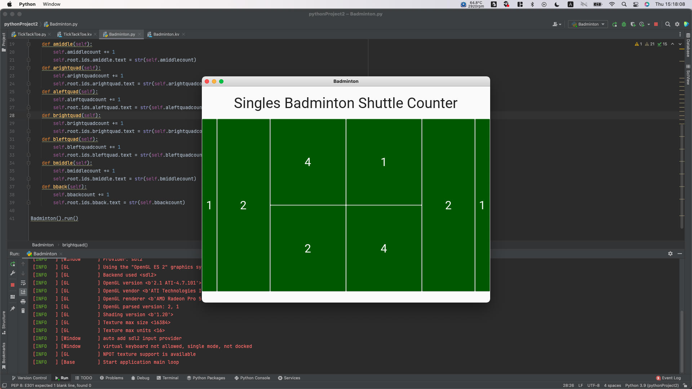

# Calculate the times the shuttle landed in every section of the court.

## Python code:

```.py
from kivy.lang import Builder
from kivymd.app import MDApp

class Badminton(MDApp):

    def build(self):
        return
    abackcount=0
    amiddlecount=0
    arightquadcount=0
    aleftquadcount=0
    brightquadcount=0
    bleftquadcount=0
    bmiddlecount=0
    bbackcount=0
    def aback(self): # A side back line
        self.abackcount+=1
        self.root.ids.aback.text=str(self.abackcount)
    def amiddle(self): # A side middle line
        self.amiddlecount += 1
        self.root.ids.amiddle.text = str(self.amiddlecount)
    def arightquad(self): # A side right service line
        self.arightquadcount += 1
        self.root.ids.arightquad.text = str(self.arightquadcount)
    def aleftquad(self): # A side left service line
        self.aleftquadcount += 1
        self.root.ids.aleftquad.text = str(self.aleftquadcount)
    def brightquad(self): # B side right service line
        self.brightquadcount += 1
        self.root.ids.brightquad.text = str(self.brightquadcount)
    def bleftquad(self): # B side left service line
        self.bleftquadcount += 1
        self.root.ids.bleftquad.text = str(self.bleftquadcount)
    def bmiddle(self): # B middle line
        self.bmiddlecount += 1
        self.root.ids.bmiddle.text = str(self.bmiddlecount)
    def bback(self): # B back line
        self.bbackcount += 1
        self.root.ids.bback.text = str(self.bbackcount)

Badminton().run()
```

## Kivy Code:

```.py
Screen:
    BoxLayout:
        orientation: "vertical"
        size_hint: 1,1

        BoxLayout:
            orientation:"vertical"
            size_hint: 1,.15
            MDLabel:
                text: "Singles Badminton Shuttle Counter"
                halign:"center"
                font_size: "40"

        BoxLayout:
            orientation:"vertical"
            size_hint:1,.8
            # Player A (Side A)
            BoxLayout:
                orientation: "horizontal"
                size_hint:1,1

                Button:
                    id:aback # Back line
                    size_hint: .2,1
                    text: "0"
                    font_size: "32"
                    background_color: 0, 1, 0, 1
                    on_release:
                        app.aback()

                Button:
                    id:amiddle # Middle line
                    size_hint: .7,1
                    text:"0"
                    font_size: "32"
                    background_color: 0, 1, 0, 1
                    on_release:
                        app.amiddle()
                BoxLayout:
                    orientation: "vertical"
                    size_hint:1,1
                    Button:
                        id:arightquad #Right service line
                        size_hint: 1,1
                        text:"0"
                        font_size: "32"
                        background_color: 0, 1, 0, 1
                        on_release:
                            app.arightquad()
                    Button:
                        id:aleftquad # Left service line
                        size_hint: 1,1
                        text:"0"
                        font_size: "32"
                        background_color: 0, 1, 0, 1
                        on_release:
                            app.aleftquad()

               #Player B (Side B)
                BoxLayout:
                    orientation: "vertical"
                    size_hint:1,1
                    Button:
                        id:brightquad #Right service line
                        size_hint: 1,1
                        text:"0"
                        font_size: "32"
                        background_color: 0, 1, 0, 1
                        on_release:
                            app.brightquad()

                    Button:
                        id:bleftquad # Left service line
                        size_hint: 1,1
                        text:"0"
                        font_size: "32"
                        background_color: 0, 1, 0, 1
                        on_release:
                            app.bleftquad()
                Button:
                    id:bmiddle # Middle line
                    size_hint: .7,1
                    text:"0"
                    font_size: "32"
                    background_color: 0, 1, 0, 1
                    on_release:
                        app.bmiddle()
                Button:
                    id:bback # Back line
                    size_hint: .2,1
                    text:"0"
                    font_size: "32"
                    background_color: 0, 1, 0, 1
                    on_release:
                        app.bback()


        BoxLayout:
            orientation: "vertical"
            size_hint: 1,.05
```


# Output:





## Sources Cited:

This time, my brain.
