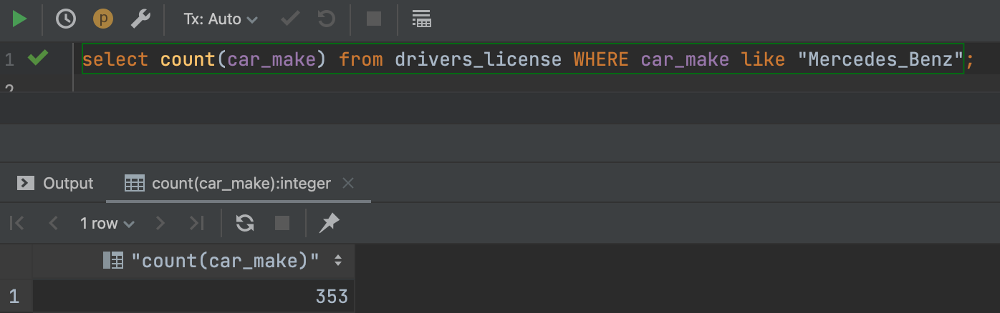
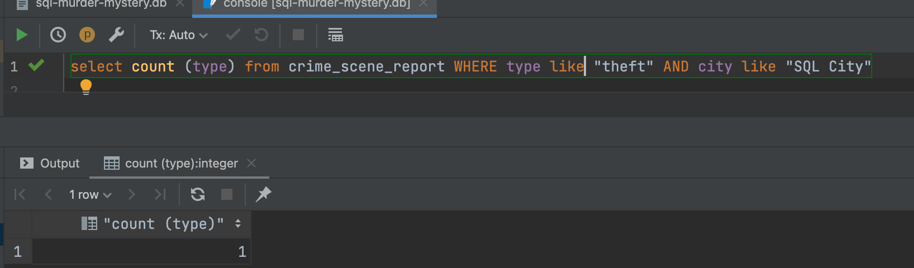
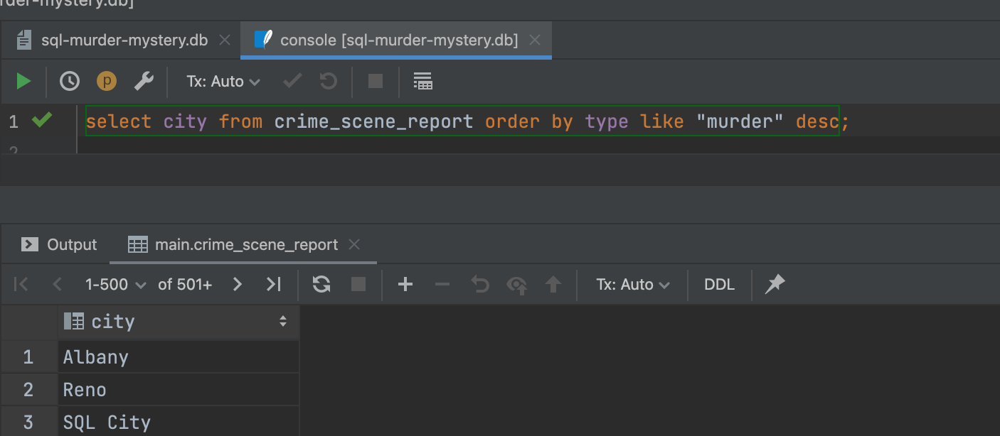
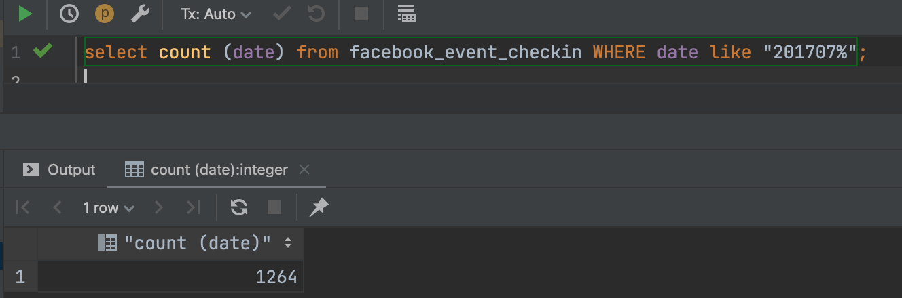
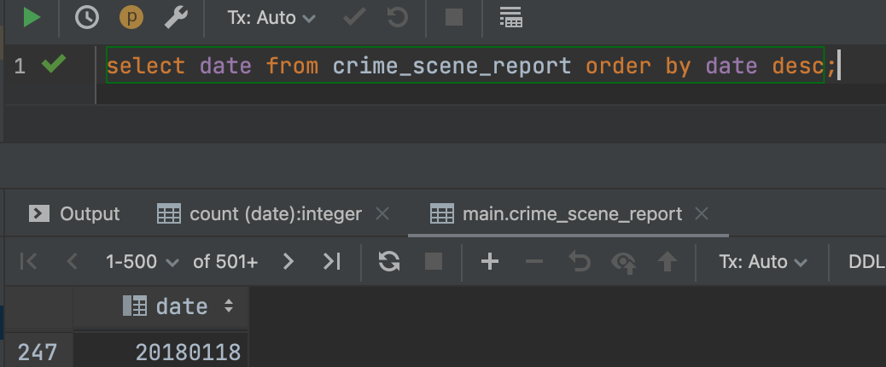

```.py
-- How many people drive a Mercedes Benz? (353)
select count(car_make) from drivers_license WHERE car_make like "Mercedes_Benz";
```


```.py
-- How many reports of theft in SQL city? (1)
select count (type) from crime_scene_report WHERE type like "theft" AND city like "SQL City"
```


```.py
-- What is the city with the most reports "murder" (Albany)
select city from crime_scene_report order by type like "murder" desc;
```


```.py
-- What is the frequency of people living in the same street
???
```
```.py
-- How many events happened on facebook during july 2017? (1264)
select count (date) from facebook_event_checkin WHERE date like "201707%";
```
```.py
-- The range of the annual income for individual qih gold membership (crashes)
Select membership_status, annual_income from person inner join income i on person.ssn inner join get_fit_now_member g on person.name = g.name order by annual_income asc;
```
```.py
-- How many crimes happeed at night (No such variable as night)
No such variable as night
```
```.py
-- What month is the most dangerous based on number of crimes (jan)
select date from crime_scene_report order by date desc;

```
```.py
-- How many crimes involve nudism (148)
select count(type) from crime_scene_report where type = "arson";
```


