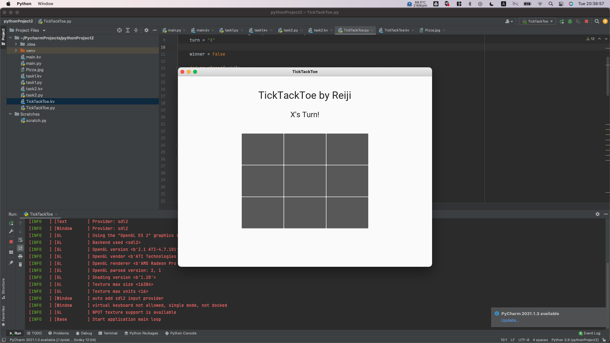
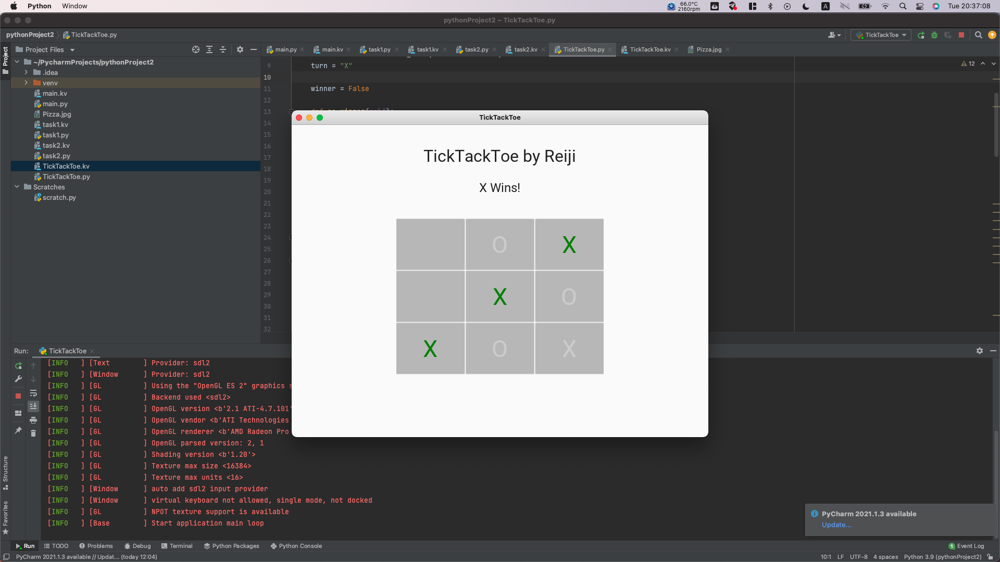

# Code:

```.py
from kivy.lang import Builder
from kivymd.app import MDApp

class TickTackToe(MDApp):
    def build(self):
        self.theme_cls.theme_style = "Light"
        self.theme_cls.primary_palette = "Red"
        return Builder.load_file("TickTackToe.kv")
    turn = "X"

    winner = False

    def no_winner(self):
        if self.winner == False and \
                self.root.ids.btn1.disabled == True and \
                self.root.ids.btn2.disabled == True and \
                self.root.ids.btn3.disabled == True and \
                self.root.ids.btn4.disabled == True and \
                self.root.ids.btn5.disabled == True and \
                self.root.ids.btn6.disabled == True and \
                self.root.ids.btn7.disabled == True and \
                self.root.ids.btn8.disabled == True and \
                self.root.ids.btn9.disabled == True:
            self.root.ids.score.text = "IT'S A TIE!!"

    def end_game(self, a, b, c):
        self.winner = True
        a.color = "green"
        b.color = "green"
        c.color = "green"

        self.disable_all_buttons()

        self.root.ids.score.text = f"{a.text} Wins!"

    def disable_all_buttons(self):
        self.root.ids.btn1.disabled = True
        self.root.ids.btn2.disabled = True
        self.root.ids.btn3.disabled = True
        self.root.ids.btn4.disabled = True
        self.root.ids.btn5.disabled = True
        self.root.ids.btn6.disabled = True
        self.root.ids.btn7.disabled = True
        self.root.ids.btn8.disabled = True
        self.root.ids.btn9.disabled = True

    def win(self):

        if self.root.ids.btn1.text != "" and self.root.ids.btn1.text == self.root.ids.btn2.text and self.root.ids.btn2.text == self.root.ids.btn3.text:
            self.end_game(self.root.ids.btn1, self.root.ids.btn2, self.root.ids.btn3)

        if self.root.ids.btn4.text != "" and self.root.ids.btn4.text == self.root.ids.btn5.text and self.root.ids.btn5.text == self.root.ids.btn6.text:
            self.end_game(self.root.ids.btn4, self.root.ids.btn5, self.root.ids.btn6)

        if self.root.ids.btn7.text != "" and self.root.ids.btn7.text == self.root.ids.btn8.text and self.root.ids.btn8.text == self.root.ids.btn9.text:
            self.end_game(self.root.ids.btn7, self.root.ids.btn8, self.root.ids.btn9)

        if self.root.ids.btn1.text != "" and self.root.ids.btn1.text == self.root.ids.btn4.text and self.root.ids.btn4.text == self.root.ids.btn7.text:
            self.end_game(self.root.ids.btn1, self.root.ids.btn4, self.root.ids.btn7)

        if self.root.ids.btn2.text != "" and self.root.ids.btn2.text == self.root.ids.btn5.text and self.root.ids.btn5.text == self.root.ids.btn8.text:
            self.end_game(self.root.ids.btn2, self.root.ids.btn5, self.root.ids.btn8)

        if self.root.ids.btn3.text != "" and self.root.ids.btn3.text == self.root.ids.btn6.text and self.root.ids.btn6.text == self.root.ids.btn9.text:
            self.end_game(self.root.ids.btn3, self.root.ids.btn6, self.root.ids.btn9)

        if self.root.ids.btn1.text != "" and self.root.ids.btn1.text == self.root.ids.btn5.text and self.root.ids.btn5.text == self.root.ids.btn9.text:
            self.end_game(self.root.ids.btn1, self.root.ids.btn5, self.root.ids.btn9)

        if self.root.ids.btn3.text != "" and self.root.ids.btn3.text == self.root.ids.btn5.text and self.root.ids.btn5.text == self.root.ids.btn7.text:
            self.end_game(self.root.ids.btn3, self.root.ids.btn5, self.root.ids.btn7)

        self.no_winner()

    def presser(self, btn):
        if self.turn == "X":
            btn.text = "X"
            btn.disabled = True
            self.root.ids.score.text = "O's Turn!"
            self.turn = "O"
        else:
            btn.text = "O"
            btn.disabled = True
            self.root.ids.score.text = "X's Turn!"
            self.turn = "X"

        self.win()

TickTackToe().run()

```

# Kivy File:

```.py
Screen:
	MDGridLayout:
		size_hint: .5, .5
		pos_hint: {"center_x": .5, "center_y": .45}
		cols: 3
		rows: 3
		Button:
			id: btn1
			text: ""
			font_size: "45sp"
			on_release: app.presser(btn1)

		Button:
			id: btn2
			text: ""
			font_size: "45sp"
			on_release: app.presser(btn2)

		Button:
			id: btn3
			text: ""
			font_size: "45sp"
			on_release: app.presser(btn3)

		Button:
			id: btn4
			text: ""
			font_size: "45sp"
			on_release: app.presser(btn4)

		Button:
			id: btn5
			text: ""
			font_size: "45sp"
			on_release: app.presser(btn5)

		Button:
			id: btn6
			text: ""
			font_size: "45sp"
			on_release: app.presser(btn6)

		Button:
			id: btn7
			text: ""
			font_size: "45sp"
			on_release: app.presser(btn7)

		Button:
			id: btn8
			text: ""
			font_size: "45sp"
			on_release: app.presser(btn8)

		Button:
			id: btn9
			text: ""
			font_size: "45sp"
			on_release: app.presser(btn9)

	MDLabel:
		id: score
		font_size: "24sp"
		text: "X's Turn!"
		halign: "center"
		pos_hint: {"center_y": .8}

	MDLabel:
	    font_size: "32sp"
	    text: "TickTackToe by Reiji"
	    halign:"center"
	    pos_hint: {"center_x":.5, "center_y": .9}
```

# Output:






# Source Cited:

Codemy.com. "Build A Tic Tac Toe Game Logic Part 2 - Python Kivy GUI Tutorial #64." YouTube, John Elder, www.youtube.com/watch?v=p7AhNDQ-EYA&list=PLCC34OHNcOtpz7PJQ7Tv7hqFBP_xDDjqg&index=64&ab_channel=Codemy.com. Accessed 1 Mar. 2022.
