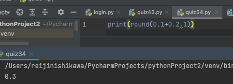

# What is the reason for the following result:
 
## 0.1 + 0.2 == 0.3 is False in Python

## Explain the reason:

When typing in 0.1+0.2 in the python console, python will give out 0.30000000000000004 as an output and therefore will not equal to 0.3. This ultimately comes down to how the computer understands code: binary. Binary contains two variables, 0 and 1 and therefore the commputer can only count in bases of 2. A computer to represent a decimal utilizes fractions, and since computers can only count in bases of two, the fractions denominator can only be in bases of 2, creating a large number of decimal fractions that cannot be represented exactly as binary fractions. This is exactly why 0.1+0.2 cannot be acurately calculated in bases of two. 

## Show a solution to this problem:

A solution to this problem is relatively simple. Since the problem is a very miniscule decimal point, utilize the round function, specify the significant values and everything seems to be working fine.

## Sources Cited

Malhotra, Parul. "Why is 0.1 + 0.2 Not Equal to 0.3 in Most Programming Languages?" Medium, 2 Sept. 2021, betterprogramming.pub/why-is-0-1-0-2-not-equal-to-0-3-in-most-programming-languages-99432310d476. Accessed 7 Apr. 2022.

"Python: “0.1 + 0.2 ≠ 0.3”. Me: “?”." Finxter – Create Your Thriving Coding Business, blog.finxter.com/python-0-1-0-2-%E2%89%A0-0-3-me-%F0%9F%A4%94/. Accessed 7 Apr. 2022.
