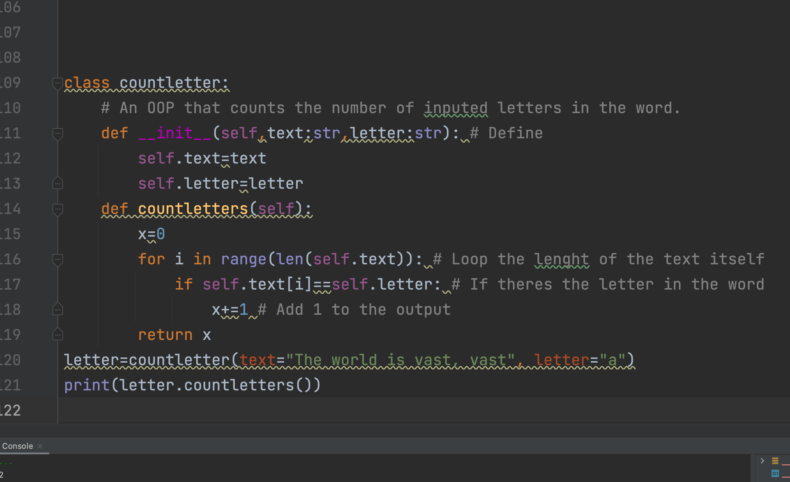

# Over the centuries a language evolves, and not only do words appear or disappear, but some letters become more used or on the contrary less used.

# In order to be able to quickly analyze many texts, create a program that calculates how many times a given letter is present in a text.


## Code
```.py
class countletter:
    # An OOP that counts the number of inputed letters in the word.
    def __init__(self,text:str,letter:str): # Define
        self.text=text
        self.letter=letter
    def countletters(self):
        x=0
        for i in range(len(self.text)): # Loop the lenght of the text itself
            if self.text[i]==self.letter: # If theres the letter in the word
                x+=1 # Add 1 to the output
        return x
letter=countletter(text="The world is vast, vast", letter="a")
print(letter.countletters())
```

## Output


