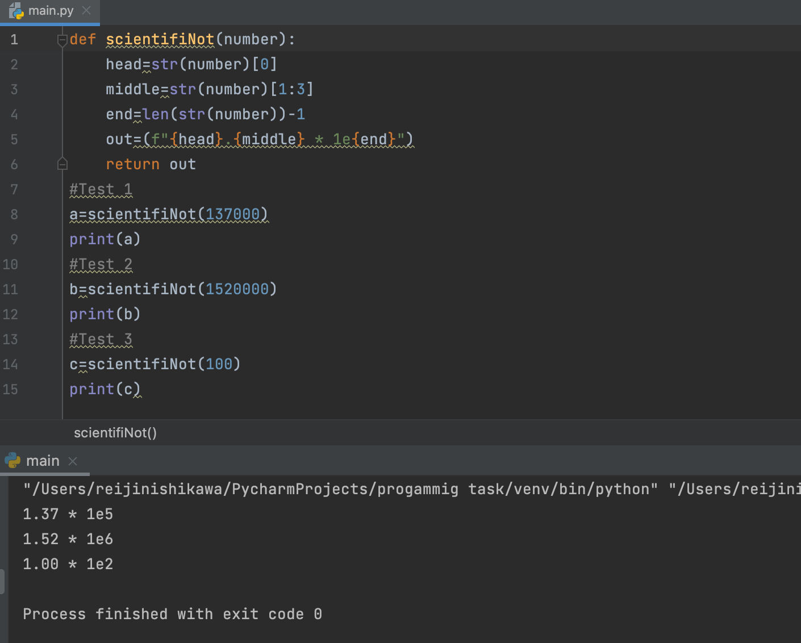

# Scientific Notation Create a function to convert every number given to scientific notation.

## scientifiNot(number: int) -> :str

```.py
def scientifiNot(number):
    head=str(number)[0]
    middle=str(number)[1:3]
    end=len(str(number))-1
    out=(f"{head}.{middle} * 1e{end}")
    return out
#Test 1
a=scientifiNot(137000)
print(a)
#Test 2
b=scientifiNot(1520000)
print(b)
#Test 3
c=scientifiNot(100)
print(c)
```

# Output:


