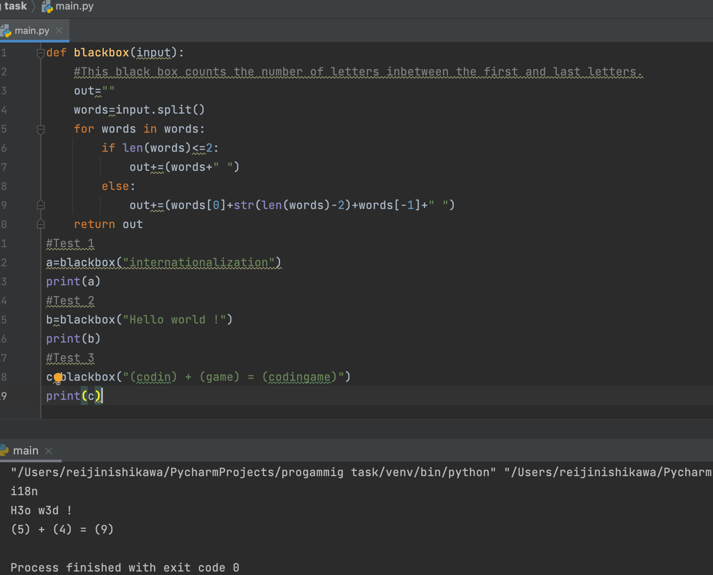

# Black Box

```.py
def blackbox(input):
    # This black box counts the number of letters inbetween the first and last letters.
    out=""
    words=input.split() # Splits words into different strings
    for words in words: # Repeat for loop for the amount of "words"
        if len(words)<=2: # If the lenght of the word is less than 2:
            out+=(words+" ") #out=the current words and a space
        else:
            out+=(words[0]+str(len(words)-2)+words[-1]+" ") # Otherwise, structure the output as according to the client
    return out
#Test 1
a=blackbox("internationalization")
print(a)
#Test 2
b=blackbox("Hello world !")
print(b)
#Test 3
c=blackbox("(codin) + (game) = (codingame)")
print(c)
```

# Output


