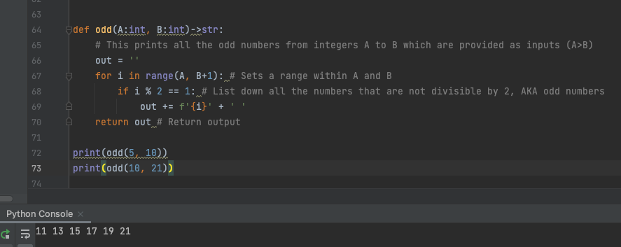

# Create a function that prints all the odd numbers from integers A to B which are provided as inputs (A>B)

## Code

```.py
def odd(A:int, B:int)->str:
    # This prints all the odd numbers from integers A to B which are provided as inputs (A>B)
    out = ''
    for i in range(A, B+1): # Sets a range within A and B
        if i % 2 == 1: # List down all the numbers that are not divisible by 2, AKA odd numbers
            out += f'{i}' + ' '
    return out # Return output

print(odd(5, 10))
print(odd(10, 21))
```

## Output


