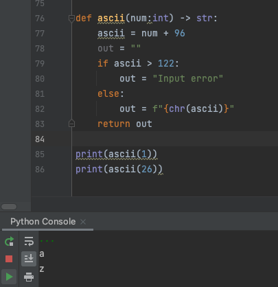

# Reverse Create a function that produces the output shown with the corresponding input.
# Change alphabet to the ASCII code. 

## Code
```.py
def ascii(num:int) -> str:
    ascii = num + 96
    out = ""
    if ascii > 122:
        out = "Input error"
    else:
        out = f"{chr(ascii)}"
    return out

print(ascii(1))
print(ascii(26))
```

# Output:


