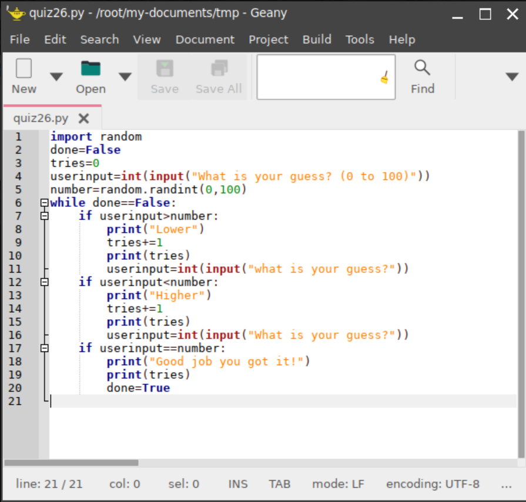
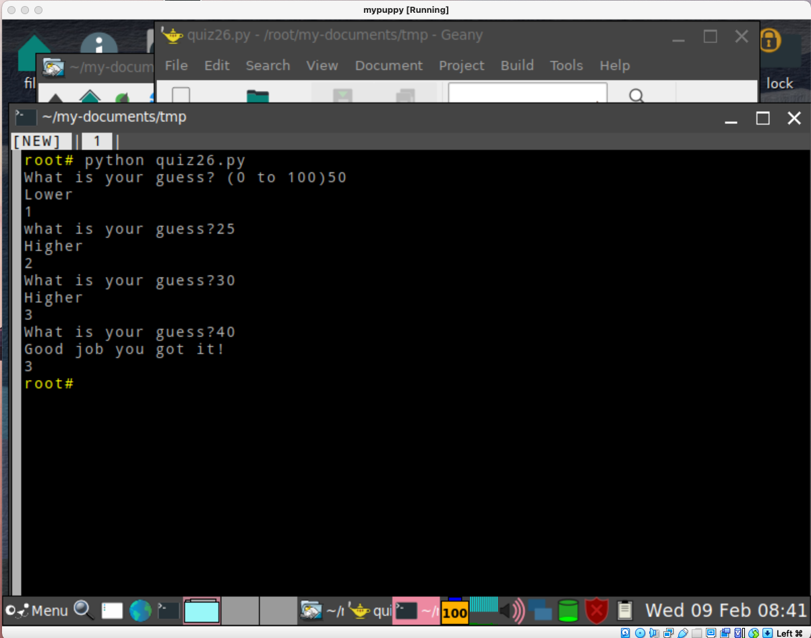

# In your virtualbox, create a python program for a game of guessing a number between 0 and 100. The program sets a secret number, the user tries to guess with the least number of tries. 

# The program should ask the user to enter a number and say if the number is higher or lower than the secret number. When the user guesses the correct number, the program will show the number of tries taken.

## Code:

## Output:

