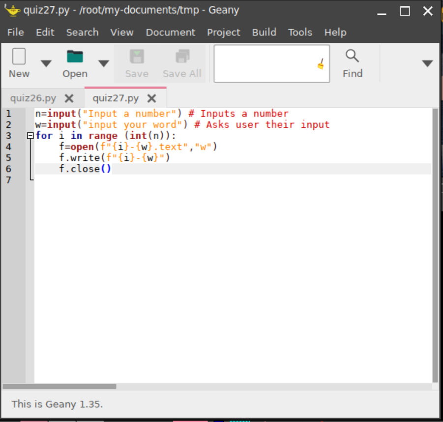
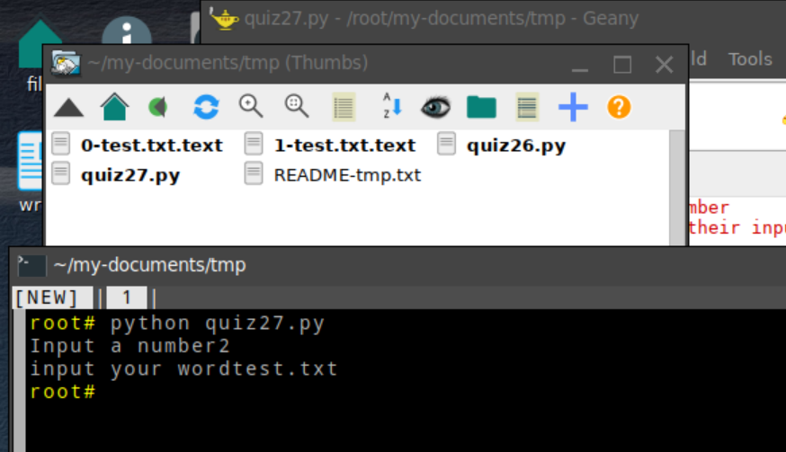

# In your virtualbox, create a python program that given a integer (N) and a word creates  N files with the word as the first line with a counter (word_N), and name N-word.txt

## Code

## Output

