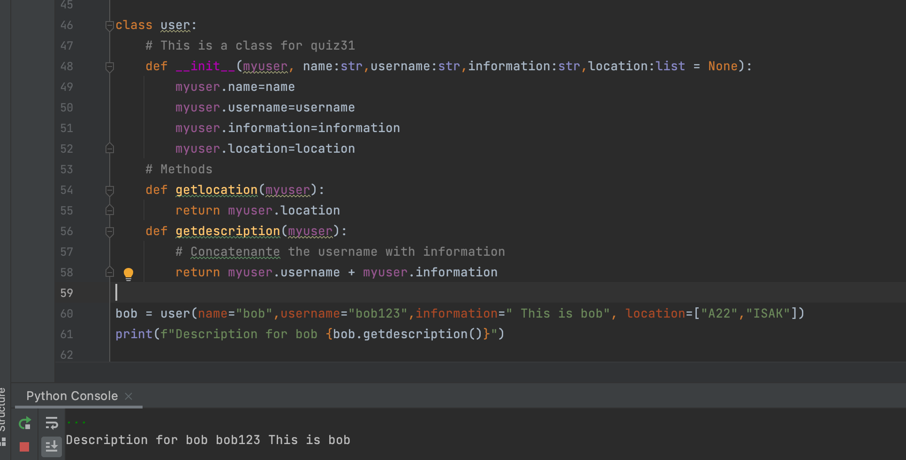

# An abundant number is a number that is smaller than the sum of its proper divisors (1 and itself excluded). Calculate the number of abundant numbers between an integer a and an integer b (a and b included).

```.py
lass user:
    # This is a class for quiz31
    def __init__(myuser, name:str,username:str,information:str,location:list = None):
        myuser.name=name # Change variable name to name
        myuser.username=username # Change variable name to username
        myuser.information=information # Change variable name to information
        myuser.location=location # Change variable name to location
    # Methods
    def getlocation(myuser):
        return myuser.location
    def getdescription(myuser):
        # Concatenante the username with information
        return myuser.username + myuser.information

bob = user(name="bob",username="bob123",information=" This is bob", location=["A22","ISAK"])
print(f"Description for bob {bob.getdescription()}")
```

# Output:


