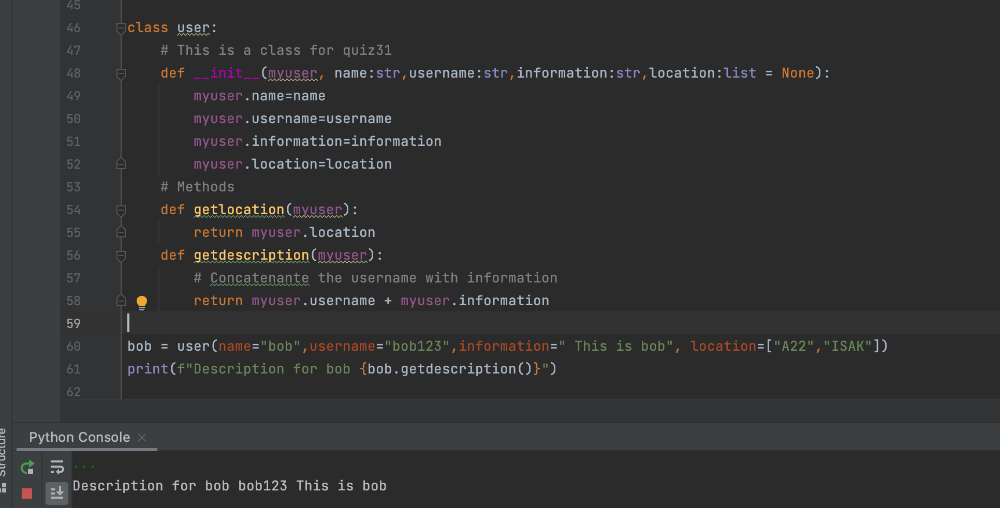

# Enter desc

'''.py
lass user:
    # This is a class for quiz31
    def __init__(myuser, name:str,username:str,information:str,location:list = None):
        myuser.name=name
        myuser.username=username
        myuser.information=information
        myuser.location=location
    # Methods
    def getlocation(myuser):
        return myuser.location
    def getdescription(myuser):
        # Concatenante the username with information
        return myuser.username + myuser.information

bob = user(name="bob",username="bob123",information=" This is bob", location=["A22","ISAK"])
print(f"Description for bob {bob.getdescription()}")
'''

# Output:

