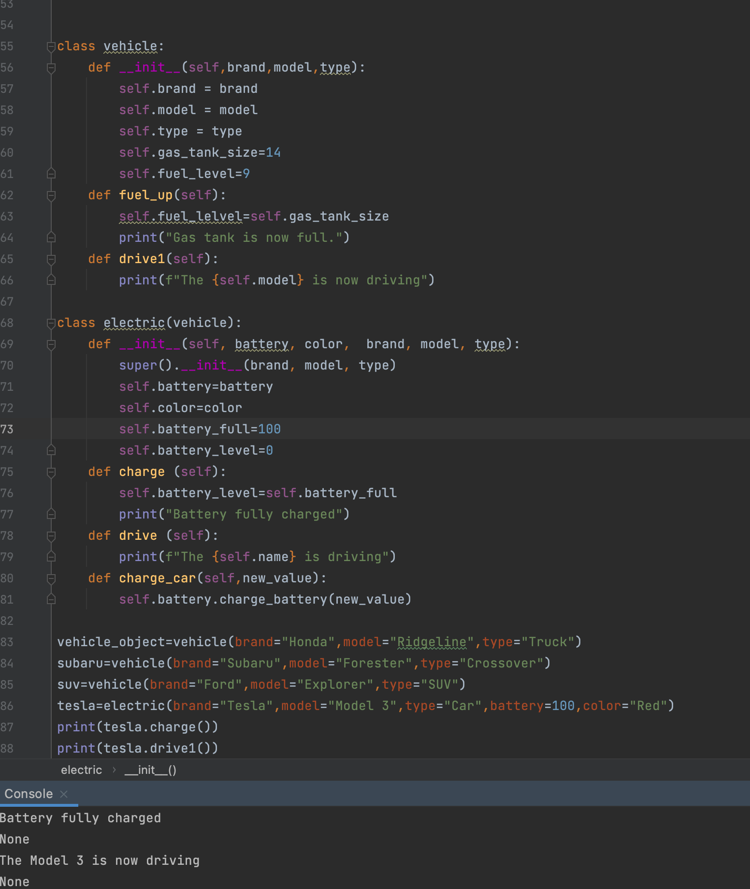

# Create a class of vehicles

## Code:

```.py
class vehicle:
    def __init__(self,brand,model,type):
        self.brand = brand
        self.model = model
        self.type = type
        self.gas_tank_size=14
        self.fuel_level=9
    def fuel_up(self):
        self.fuel_lelvel=self.gas_tank_size
        print("Gas tank is now full.")
    def dtive(self):
        print(f"The {self.model} is now driving")

class electric(vehicle):
    def __init__(self,brand, model, type):
        super().__init__(brand, model, type)
        self.battery=battery
        self.battery_full=100
        self.battery_level=0
    def charge (self):
        self.battery_level=self.battery_full
        print("Battery fully charged")
    def drive (self):
        print(f"The car is driving")
    def charge_car(self,new_value):
        self.battery.charge_battery(new_value)

class battery:
    def __init__(self,size:int=20):
        self.size=size
        self.charge_level=1
        self.charge_full=100
    def get_charge(self):
        return self.charge_level
    def get_range(self):
        return self.charge_level*10
    def charge_battery(self, new_charge):
        self.charge_level=new_charge

vehicle_object=vehicle(brand="Honda",model="Ridgeline",type="Truck")
subaru=vehicle(brand="Subaru",model="Forester",type="Crossover")
suv=vehicle(brand="Ford",model="Explorer",type="SUV")

tesla=electric(brand="Tesla",model="Model 3",type="Car")
tesla.charge()
tesla.drive()
new_charge=500
new_value=599
tesla.battery.charge_battery

replacement_bat=battery()
print(replacement_bat.get_charge())

import random
stock_bats=[]
for i in range(100):
    a_battery=battery(size=random.randint(10,100))
    stock_bats.append
    print(a_battery)
for i in range (100):
    stock_bats.append(100)
for bat in stock_bats:
    bat.charge_bat(50)
    
```

## Output


