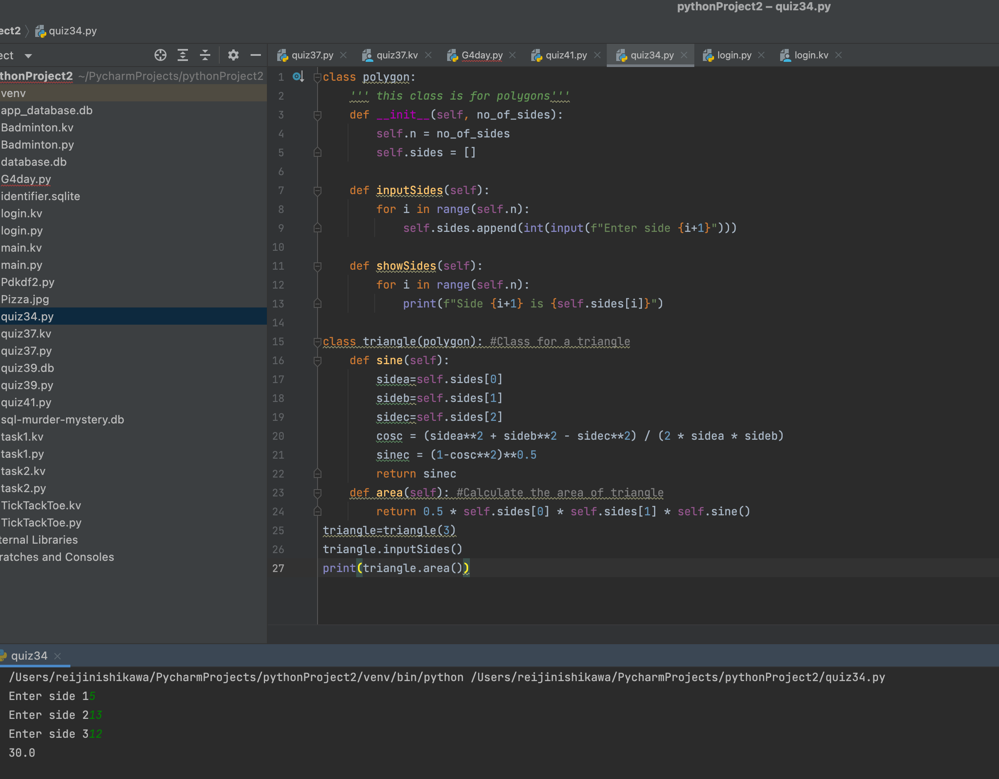

# Using the class shown for a Polygon, create a child class for Triangle and add a method to calculate the area.

```.py
class polygon:
    ''' this class is for polygons'''
    def __init__(self, no_of_sides):
        self.n = no_of_sides
        self.sides = []

    def inputSides(self):
        for i in range(self.n):
            self.sides.append(int(input(f"Enter side {i+1}")))

    def showSides(self):
        for i in range(self.n):
            print(f"Side {i+1} is {self.sides[i]}")

class triangle(polygon): #Class for a triangle
    def sine(self):
        sidea=self.sides[0]
        sideb=self.sides[1]
        sidec=self.sides[2]
        cosc = (sidea**2 + sideb**2 - sidec**2) / (2 * sidea * sideb)
        sinec = (1-cosc**2)**0.5
        return sinec
    def area(self): #Calculate the area of triangle
        return 0.5 * self.sides[0] * self.sides[1] * self.sine()
triangle=triangle(3)
triangle.inputSides()
print(triangle.area())
```

# Output:


