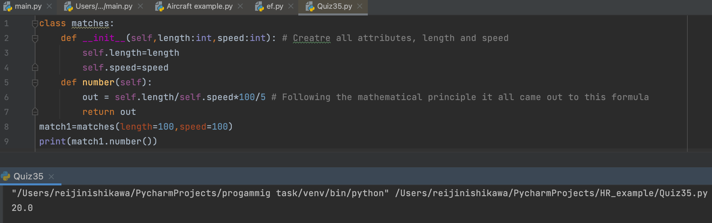

# Lily was crossing a thick forest when she realizes that there is a tiger ahead of her who has seen Lily. Lily quickly takes out a matchbox from her bag and burns a matchstick, because the tiger is afraid of fire. A matchstick takes 5 seconds to burn completely. Given that the length of the forest that Lily needs to cross is l meters , and that Lily's speed is s centimeters per second, print the minimum number of matchsticks Lily needs to burn to cross the forest safely.

## Code
```.py
class matches:
    def __init__(self,length:int,speed:int): # Creatre all attributes, length and speed
        self.length=length
        self.speed=speed
    def number(self):
        out = self.length/self.speed*100/5 # Following the mathematical principle it all came out to this formula
        return out
match1=matches(length=100,speed=100)
print(match1.number())
```
## Output


