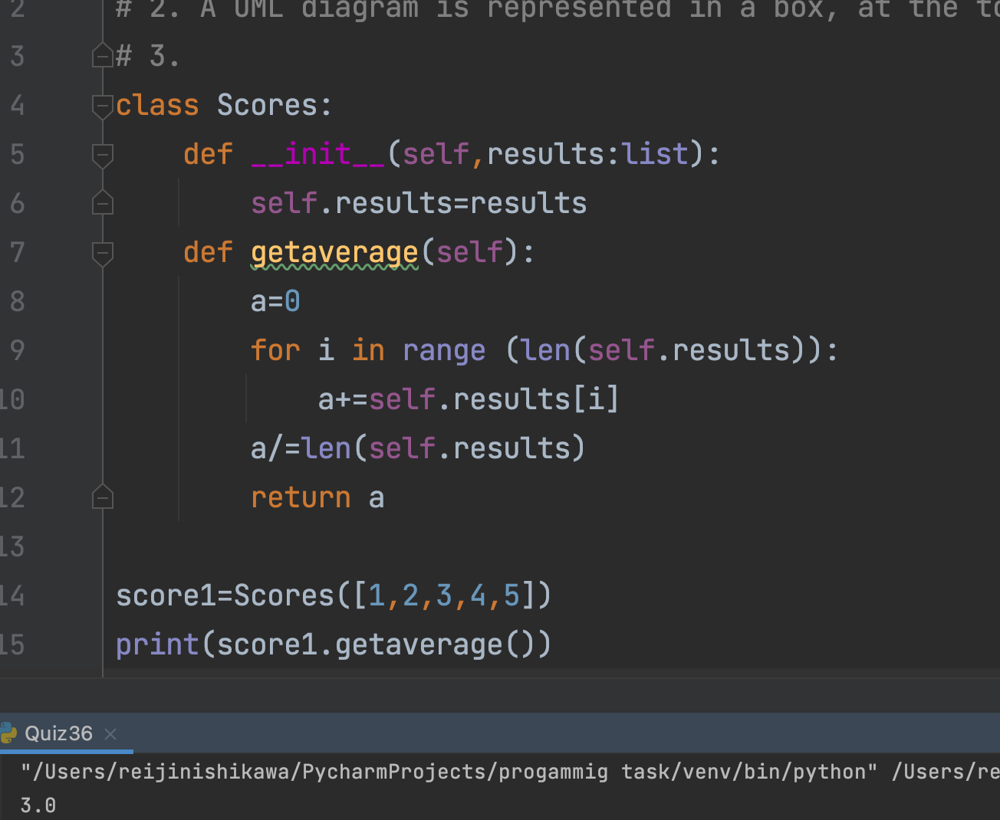

```.py
# 1. Encapsulation, Abstraction, Inheritance, and Polymorphism
# 2. A UML diagram is represented in a box, at the top there are classes, and below that show the attributes of the class, and lastly on the bottom it shows the various methods of the attributes.
# 3.
class Scores:
    def __init__(self,results:list):
        self.results=results
    def getaverage(self):
        a=0
        for i in range (len(self.results)):
            a+=self.results[i]
        a/=len(self.results)
        return a

score1=Scores([1,2,3,4,5])
print(score1.getaverage())
```

# Output:

