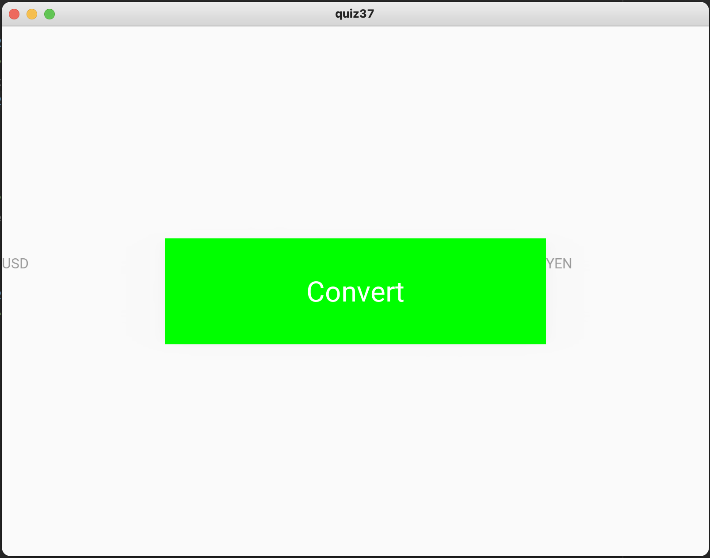

# Create the GUI shown below

## Python code: 

```.py
from kivymd.app import MDApp

class quiz37(MDApp):
    def build(self):
        return

quiz37().run()
```

## KivyMD code:

```.py
Screen:
    MDBoxLayout: #Setting up a boundary for the GUI
        orientation: "horizontal"
        size_hint: 1, 1
        pos_hint: {'center_x': 0.5, 'center_y': 0.5}
        MDTextField: #Text field of the USD button
            id: USD
            hint_text: "USD"
            font_size: "32pt"
            size_hint: .15, .20
            pos_hint: {'center_x': 0.1, 'center_y': 0.5}
        MDRaisedButton:  #Text field of the CONVERT button
            size_hint: .35, .20
            halign: "center"
            text: "Convert"
            font_size: "24pt"
            md_bg_color: 0, 1, 0, 1
            pos_hint: {'center_x': 0.5, 'center_y': 0.5}
        MDTextField: #Text field of the YEN button
            id: YEN
            hint_text: "YEN"
            font_size: "32pt"
            size_hint: .15, .20
            pos_hint: {'center_x': 0.9, 'center_y': 0.5}
```

## Output:


