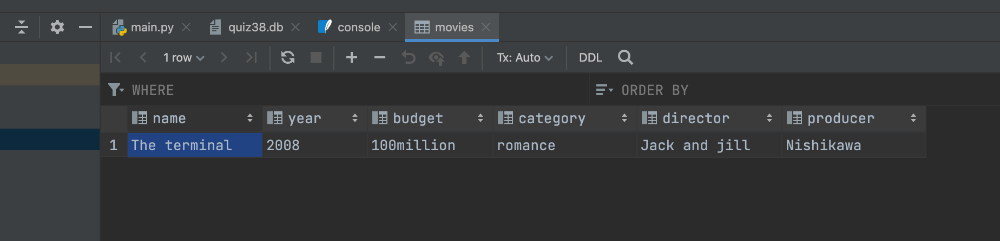

# Create the database shown in the ER diagram below and insert one example

## SQL console

```.py
create table movies (name varchar(100),  #creates a table
year varchar(100), # creates a "year" row
budget varchar(100), # creates a "budget" row
category varchar(100), # creates a "category" row
director varchar(100), # creates a "director" row
producer varchar(100)) # creates a "producer" row

insert into movies(name,year,budget,category,director,producer)values ("The terminal","2008","100million","romance","Jack and jill","Nishikawa")
# insert data according to the rows created
```

## Output

