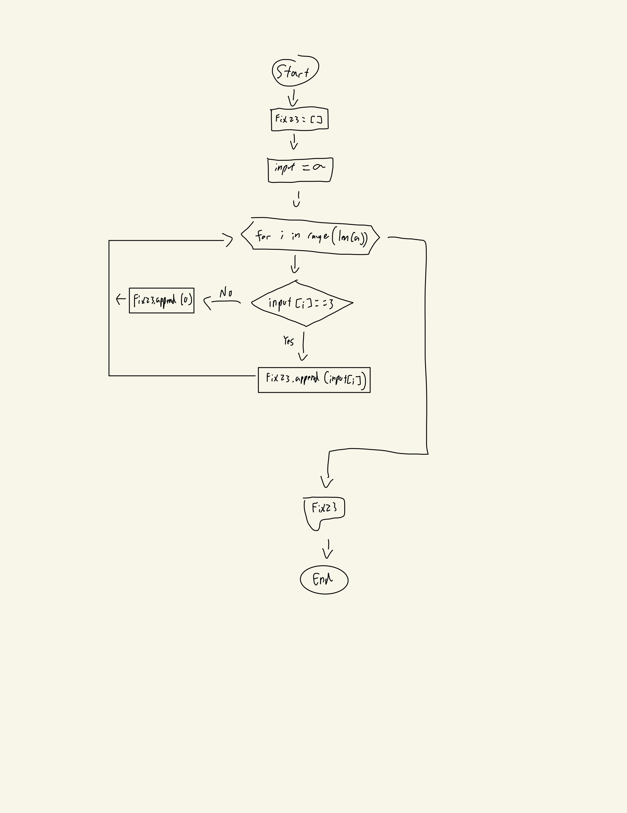

# Create the flow diagram for: Given an array of integers, any time there is a 2 followed by a 3, change the 3 to a 0. Output the changed array. 

## Examples

Fix23([1, 2, 3, 4]) → [1, 2, 0, 4]
Fix23([1, 2, 1]) → [1, 2, 1]

## Output

