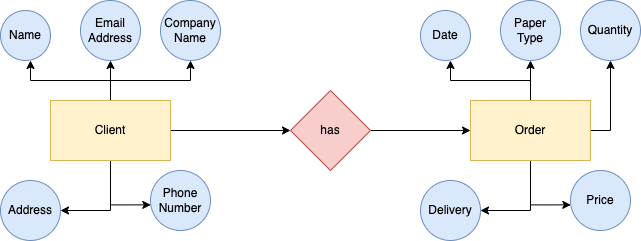

# A paper company requires a database to store the orders received from their clients. Order of papers include the date, the paper type, the quantity, the price and delivery date. Regarding the client, information stored in the database include contact name, address, phone number, email address, company name. Clients are related to orders.

## Create the ER diagram for the situation explained above.

