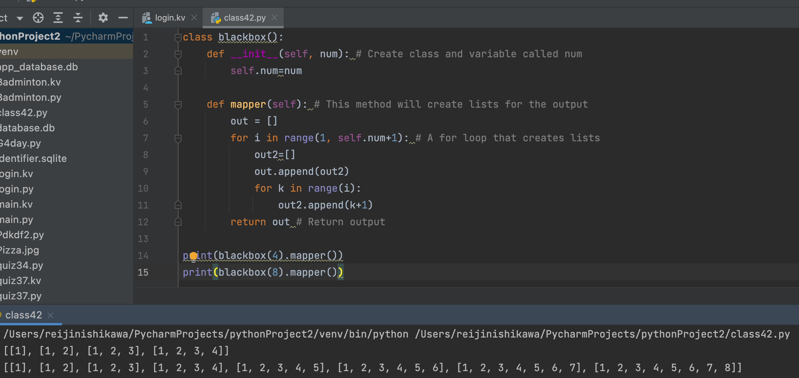

# Black Box

## Create the program that produces the output with the input shown


## Python Code

```.py
class blackbox():
    def __init__(self, num): # Create class and variable called num
        self.num=num

    def mapper(self): # This method will create lists for the output
        out = []
        for i in range(1, self.num+1): # A for loop that creates lists
            out2=[]
            out.append(out2)
            for k in range(i):
                out2.append(k+1)
        return out # Return output

print(blackbox(4).mapper())
print(blackbox(8).mapper())
```

## Output


