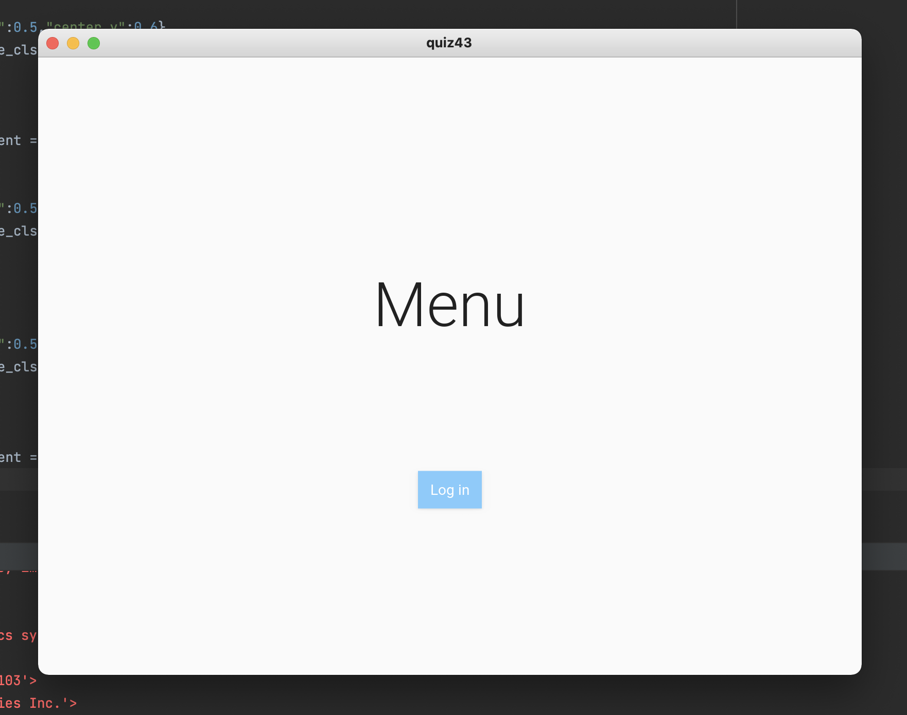
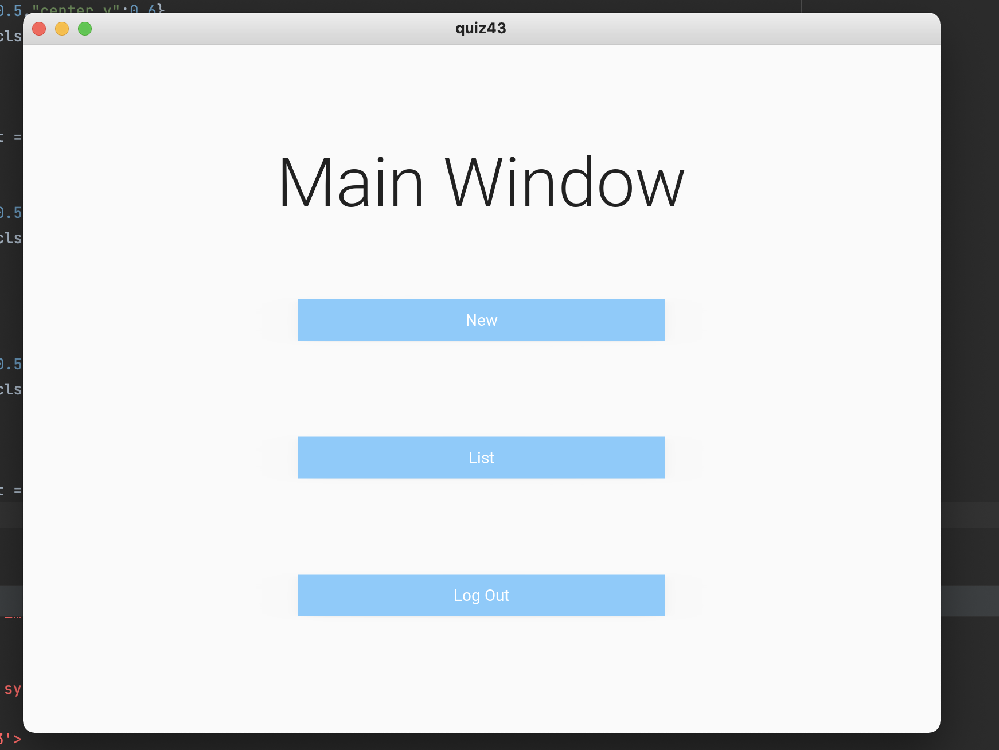
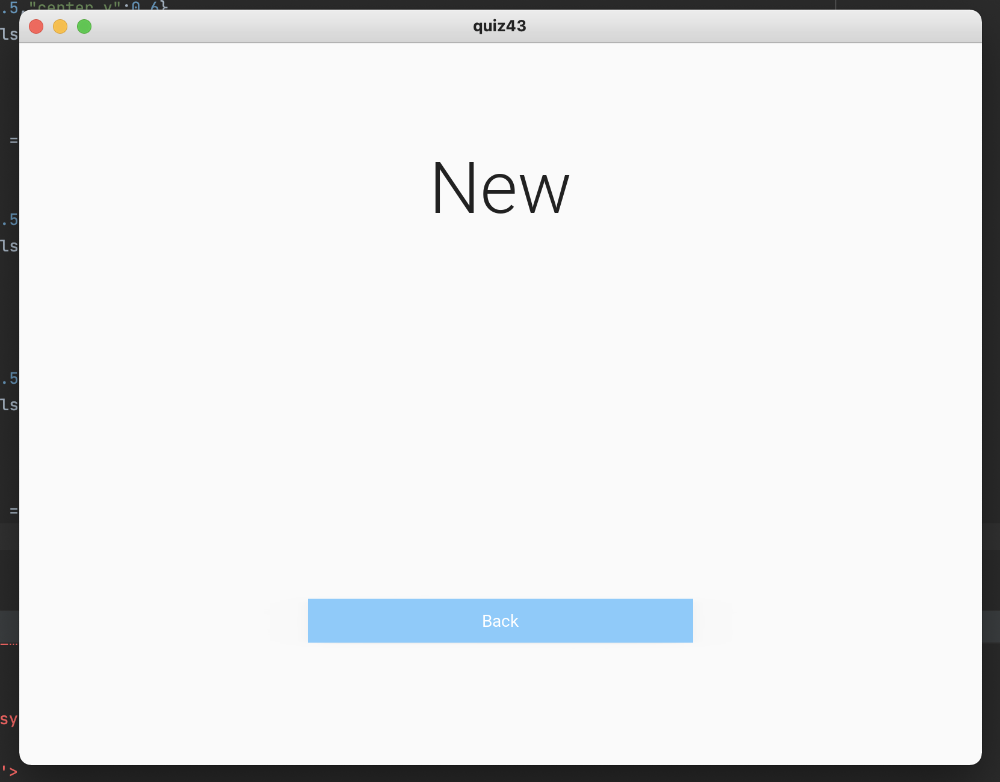

# Create the UI shown in the wireframe below:

## Python Code 

```.py
from kivymd.app import MDApp
from kivymd.uix.screen import MDScreen

class LoginScreen(MDScreen):
    pass

class MainScreen(MDScreen):
    pass

class NewScreen(MDScreen):
    pass

class quiz43(MDApp):
    def build(self):
        return

quiz43().run()
```
## Kivy Code

```.py
ScreenManager:
    # This is where all the ids are made for each screen
    id: scr_manager

    LoginScreen:
        name: "LoginScreen"

    MainScreen:
        name: "MainScreen"

    NewScreen:
        name: "NewScreen"

<LoginScreen> # Code for the GUI of the Login Screen
    MDLabel:
        # Text heading of menu
        text: "Menu"
        font_style:'H2'
        halign: 'center'
        pos_hint:{"center_x":0.5, "center_y":0.6}

    MDRaisedButton:
        # Button that will Login
        text: "Log in"
        pos_hint: {"center_x":0.5,"center_y":0.3}
        md_bg_color:app.theme_cls.primary_light
        width:root.width*0.4
        size_hint: None,None
        on_release:
            root.parent.current = "MainScreen"

<MainScreen>
# Code for the GUI of the Main Screen
    MDLabel:
        text: "Main Window"
        font_style:'H2'
        halign: 'center'
        pos_hint:{"center_x":0.5, "center_y":0.8}
    MDRaisedButton:
        # Button for "new"
        text: "New"
        pos_hint: {"center_x":0.5,"center_y":0.6}
        md_bg_color:app.theme_cls.primary_light
        width:root.width*0.4
        size_hint: None,None
        on_release:
            root.parent.current = "NewScreen"
    MDRaisedButton:
        # Button that goes to "list"
        text: "List"
        pos_hint: {"center_x":0.5,"center_y":0.4}
        md_bg_color:app.theme_cls.primary_light
        width:root.width*0.4
        size_hint: None,None
    MDRaisedButton:
        # Button that will LogOut
        text: "Log Out"
        pos_hint: {"center_x":0.5,"center_y":0.2}
        md_bg_color:app.theme_cls.primary_light
        width:root.width*0.4
        size_hint: None,None
        on_release:
            root.parent.current = "LoginScreen"
<NewScreen> 
# Code for the GUI of the New Screen
    MDLabel:
        text: "New"
        font_style:'H2'
        halign: 'center'
        pos_hint:{"center_x":0.5, "center_y":0.8}
    MDRaisedButton:
        # Button that will go back
        text: "Back"
        pos_hint: {"center_x":0.5,"center_y":0.2}
        md_bg_color:app.theme_cls.primary_light
        width:root.width*0.4
        size_hint: None,None
        on_release:
            root.parent.current = "MainScreen"
```

## Output






