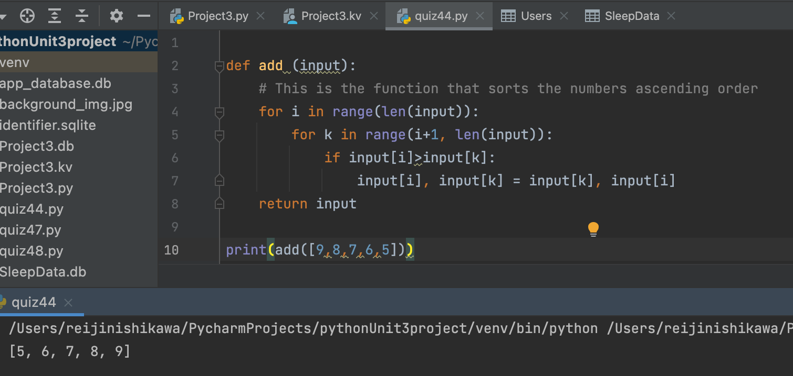

# Create a program that orders a input list of numbers from smaller to larger numbers

```.py

def add (input):
    # This is the function that sorts the numbers ascending order
    for i in range(len(input)):
        for k in range(i+1, len(input)):
            if input[i]>input[k]:
                input[i], input[k] = input[k], input[i]
    return input

print(add([9,8,7,6,5]))

```

## Output: 

