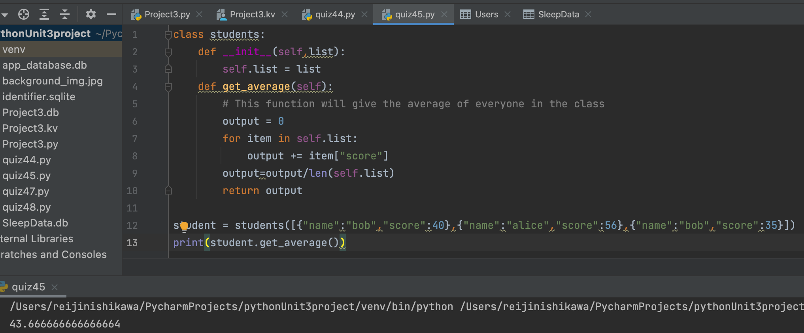

# Student information in a class is stored in an list of dictionaries like:

```.py
class students:
    def __init__(self,list):
        self.list = list
    def get_average(self):
        # This function will give the average of everyone in the class
        output = 0
        for item in self.list:
            output += item["score"]
        output=output/len(self.list)
        return output

student = students([{"name":"bob","score":40},{"name":"alice","score":56},{"name":"bob","score":35}])
print(student.get_average())
```

## Output:


