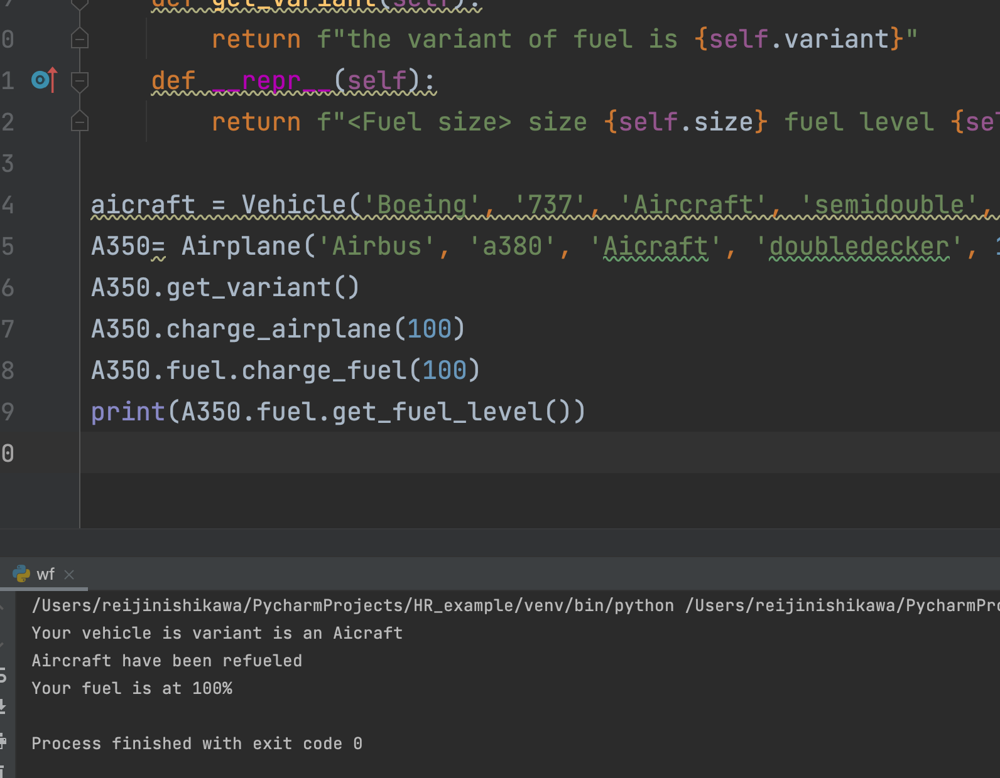

Homework Requirement
#1-Two classes that are related Parent-child
#2-One more class.
#3- One of the classes in #1 uses the class in #2
#4- Minimum 5 attributes on each class
#5- Minimum 6 methods per class
#6- Minimum 4 objects per class (tests)

```.py
class Vehicle:
    def __init__(self, manufacturer, model, variant, size, speed):
        self.manufacturer = manufacturer
        self.model = model
        self.variant = variant
        self.fuel_tank_size = 14
        self.fuel_level = 0
        self.size=size
        self.speed=speed
    def fuel_up(self):
        self.fuel_level = self.fuel_tank_size
        print('Fuel at 100%')
    def drive(self):
        print(f'The {self.model} is now driving.')
    def increase_speed(self):
        self.speed *= 1.1
        print(f"the maximum speed of the airplane is {self.speed}")
    def get_speed(self):
        print(f"the maximum speed of the airplane is {self.speed}")
    def get_size(self):
        print(f"the size of the airplane is {self.size}")
    def get_variant(self):
        print(f"Your vehicle is variant is an {self.variant}")

class Airplane(Vehicle):
    def __init__(self, brand, model, variant, size, speed):
        super().__init__(brand, model, variant, size, speed)
        self.size=size
        self.speed=speed
        self.fuel = FuelStorage("airbus", "10000", "low", "Airplane" )
        self.fuel_level = 0
    def charge_airplane(self, new_value):
        self.fuel.charge_fuel(new_value)
        print('Aircraft have been refueled')
    def fuel_up(self):
        print('This airplane has no fuel tank!')
    def decrease_speed(self):
        self.speed *= 0.9
        print(f"the new speed is {self.speed}")
    def get_model(self):
        print(f"the model of the airbus is {self.model}")
    def get_brand(self):
        print(f"the brand of the airbus is {self.brand}")

class FuelStorage:
    def __init__(self, brand, amount, consumption, variant, size=30):
        self.size = size
        self.fuel_level = 0
        self.variant=variant
        self.consumption=consumption
        self.amount=amount
        self.brand=brand
    def get_fuel_level(self):
        return f"Your fuel is at {self.fuel_level}%"
    def get_amount(self):
        return 10*self.fuel_level
    def charge_fuel(self, new_value):
        self.fuel_level = new_value
    def get_variant(self):
        return f"the variant of fuel is {self.variant}"
    def __repr__(self):
        return f"<Fuel size> size {self.size} fuel level {self.charge_level}"

aicraft = Vehicle('Boeing', '737', 'Aircraft', 'semidouble', 20000)
A350= Airplane('Airbus', 'a380', 'Aicraft', 'doubledecker', 15000)
A350.get_variant()
A350.charge_airplane(100)
A350.fuel.charge_fuel(100)
print(A350.fuel.get_fuel_level())
```

## Output:


